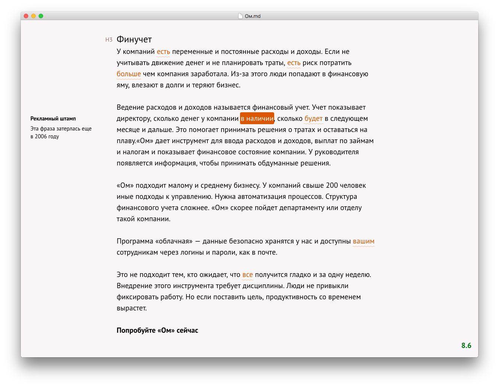

# Optima — text editor that checks text style and spelling

[Optima](http://getoptima.ru/?ref=novichkov.link) — a text editor that I developed on the Electron platform using React and Redux. This is a commercial product launched in 2016.

It checks text style and spelling for the Russian language, using external services.

It works with Markdown files but as a WYSIWYG editor. The user gets an easy-to-use minimalistic text editor that works offline.

It has quick sharing of text via links:

Share a link

And also, a typography tool that helps to prepare text for publication:

The typography tool has settings and preferences for Russian or English typography notation:

