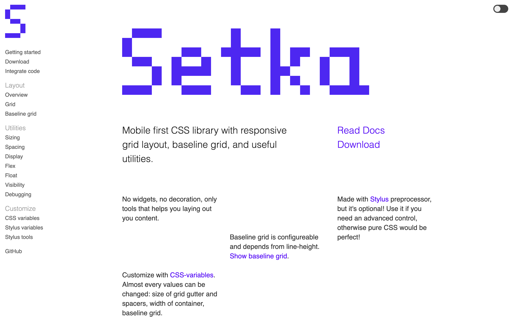
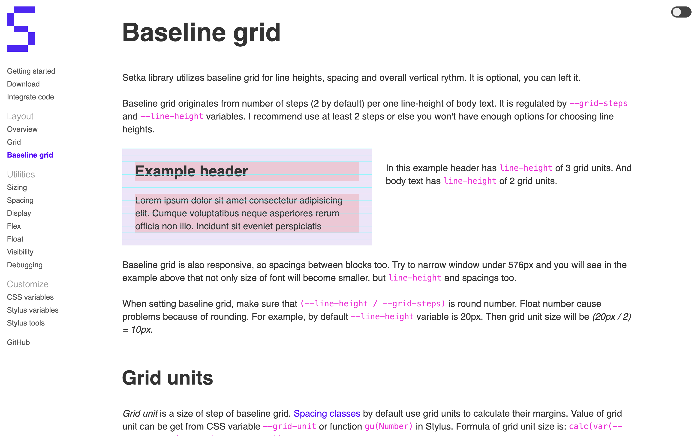
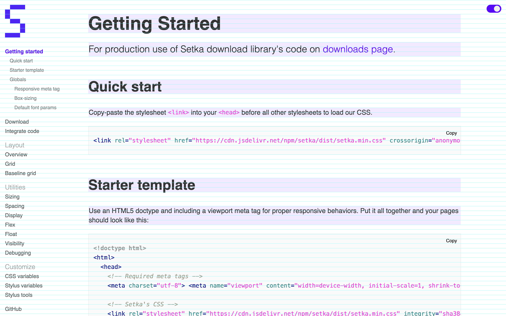

# Setka — CSS library with grid and layout management tools

I have made [Setka](https://anovi.github.io/setka/?ref=indesigner-portfolio.ghost.io) — a mobile-first CSS library with a responsive grid layout, baseline grid, and useful utilities.

It is based on Bootstrap's grid and CSS utilities. The motivation was to make a library that helps with layout and vertical rhythm but does not intervene in the decoration of elements.

I rewrote Bootstrap's grid code in Stylus using _grid_ layout. At the time, Bootstrap had been using the _flex_ layout.

[Documentation](https://anovi.github.io/setka/?ref=indesigner-portfolio.ghost.io) on GitHub pages was made:

The library was used for projects in [Finolog](https://finolog.ru/) and a personal website.